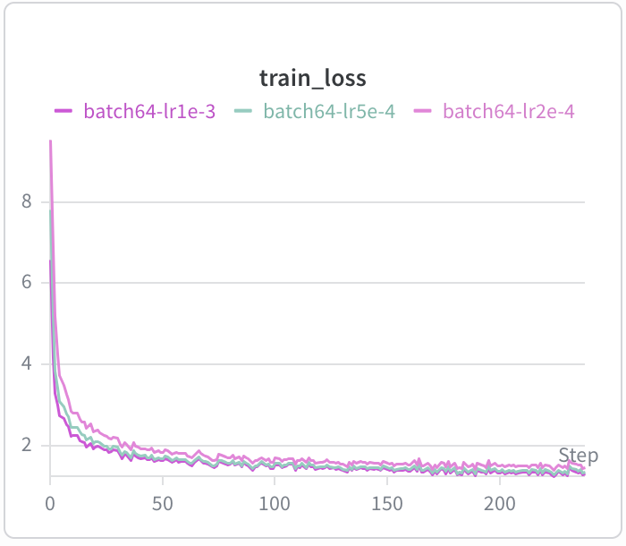
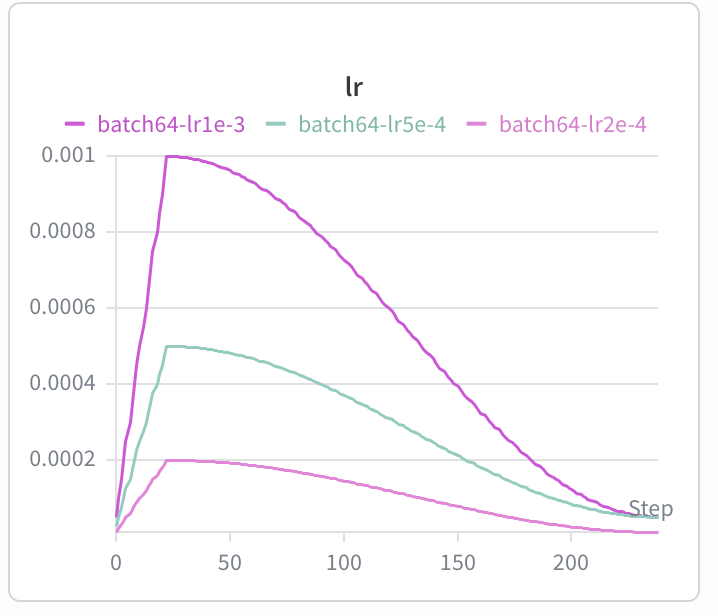
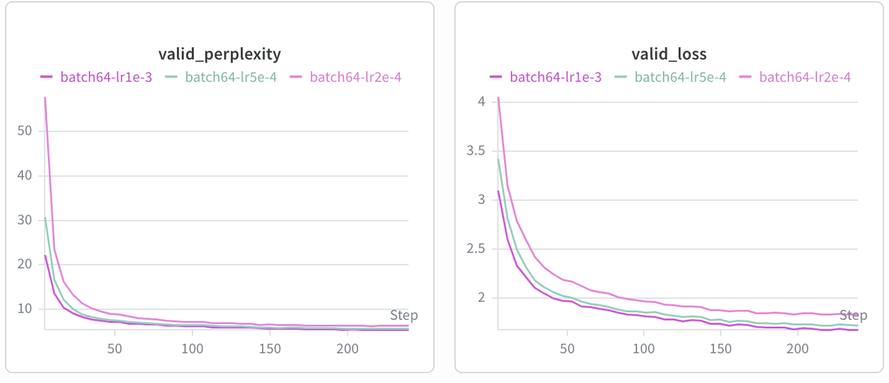

# CS336 Basics - BPE Tokenizer & Transformer LM

实现 BPE 分词器和 Transformer 语言模型的训练。

## 代码结构

```
.
├── cs336_basics/              # 核心模块
│   ├── tokenizer.py          # BPE 分词器实现
│   ├── basic_module.py       # TransformerLM、CrossEntropy 等
│   ├── data.py               # 数据加载
│   ├── optimizer.py          # SimpleAdamW、优化器
│   └── utils.py              # 工具函数
├── scripts/
│   ├── train_bpe.py           # 训练 BPE 分词器
│   ├── train_lm.py            # 训练 TransformerLM
│   └── encode.py             # 分词器编码
├── tests/                    # 单元测试
└── data/                     # 数据目录
```

## BPE 分词器

### 10k词表训练测试 (TinyStories)
| 指标 | 10k 词表 | 50k 词表 |
|------|---------|---------|
| vocab_size | 10,000 | 50,257 |
| merges | 9,744 | 50,001 |
| 压缩率 | ~4 bytes/token | ~4.2 bytes/token |
| 编码速度 | - | 295,367 bytes/s |

### 使用

#### train
train_bpe.py

#### tokenizer
```python
from cs336_basics.tokenizer import Tokenizer

tokenizer = Tokenizer.from_files(
    vocab_filepath=args.vocab_path,
    merges_filepath=args.merge_path,
    special_tokens=["<|endoftext|>"]
)

ids = tokenizer.encode("Once upon a time, there was a tiny story.")
text = tokenizer.decode(ids)
```

## Transformer 语言模型

### 模型配置
| 参数 | 值 |
|------|-----|
| vocab_size | 50,257 |
| context_length | 1,024 |
| num_layers | 48 |
| d_model | 1,600 |
| num_heads | 25 |
| d_ff | 6,400 |

### 参数量 (~1.6B)
- Embedding: ~80M
- Transformer layers: ~1.47B
- Final projection: ~80M

单精度 float32 显存约 8.4GB。

### FLOPs 估算

#### 单层 FLOPs 构成
- MultiHeadAttn: QKV (8*s*d*d) + Attention (4*s*s*d)
- FFN: 4 * s * d * d_ff
- Final Projection: 2 * s * d * vocab_size

#### 不同规模 GPT 对比 (seq_len=1024)

| 模型 | layers | d_model | 总 FLOPs | Attention | FFN | final_proj |
|------|--------|---------|----------|-----------|-----|------------|
| GPT-2 small | 12 | 768 | 0.29T | 33.2% | 39.8% | 27.1% |
| GPT-2 medium | 24 | 1024 | 0.83T | 37.4% | 49.9% | 12.7% |
| GPT-2 large | 36 | 1280 | 1.77T | 38.1% | 54.5% | 7.4% |
| 本项目 | 48 | 1600 | 3.51T | 37.9% | 57.4% | 4.7% |

#### 长序列影响 (layers=48, d_model=1600)

| seq_len | 总 FLOPs | attn_qkv | FFN |
|---------|----------|----------|-----|
| 1,024 | 3.51T | 9.2% | 57.4% |
| 16,384 | 133.5T | 61.8% | 24.1% |

> 序列越长，attention score 计算占比越高，FFN 占比相对下降。

## 训练结果 (TinyStories)

 



```
One day, a little cat named Tom went for a walk. He was very happy because
the sun was shining and the birds were singing. As he walked, he saw a big,
shiny balloon in the sky. It was so pretty. Tom wanted to take the balloon
and play with it.

As Tom got closer to the balloon, he met a dog named Max. Max said, "Hi Tom!
I see you found my balloon. It's so big and fun to play with. Do you want to
play with me?" Tom nodded his head and they started to play together.

They played with the balloon and had a lot of fun. But then, something unexpected
happened. The balloon popped, and out came many small, shiny release into the sky!
Tom and Max were surprised and happy. They took the magic balloon and played all
day long.
```

